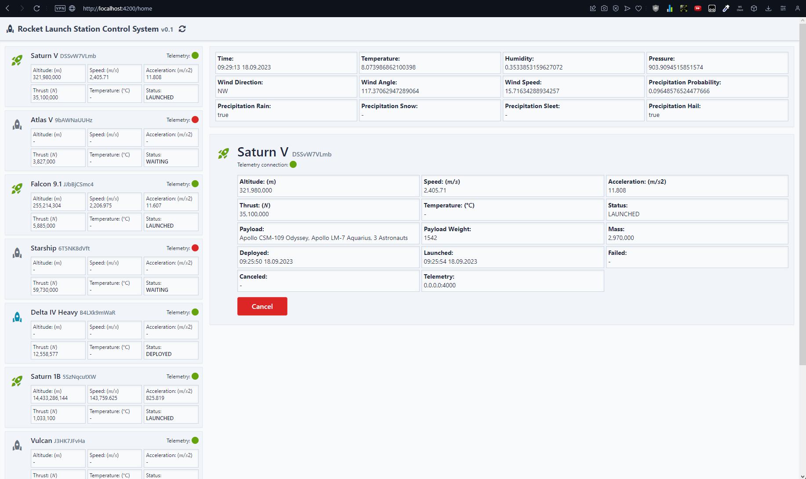

1. Run docker
2. Run proxy websocket server `php -f ws.php`
3. Run frontend `ng serve`
4. Open localhost:4200

## Rocketclient

This project was generated with [Angular CLI](https://github.com/angular/angular-cli) version 16.2.2.

## Development server

Run `ng serve` for a dev server. Navigate to `http://localhost:4200/`. The application will automatically reload if you change any of the source files.

Then run `php -f ws.php`

## References

- https://angular.io
- https://github.com/marella/material-icons
- https://tailwindcss.com
- https://fontawesome.com/v4/icons/
- https://github.com/akalongman/php-websockets-chat/blob/master/server.php
- https://www.php.net/ (PHP 8.0.13)
- https://www.postman.com/
- https://www.docker.com/
- https://chat.openai.com/ (decoding communication protocol)

## Layout

